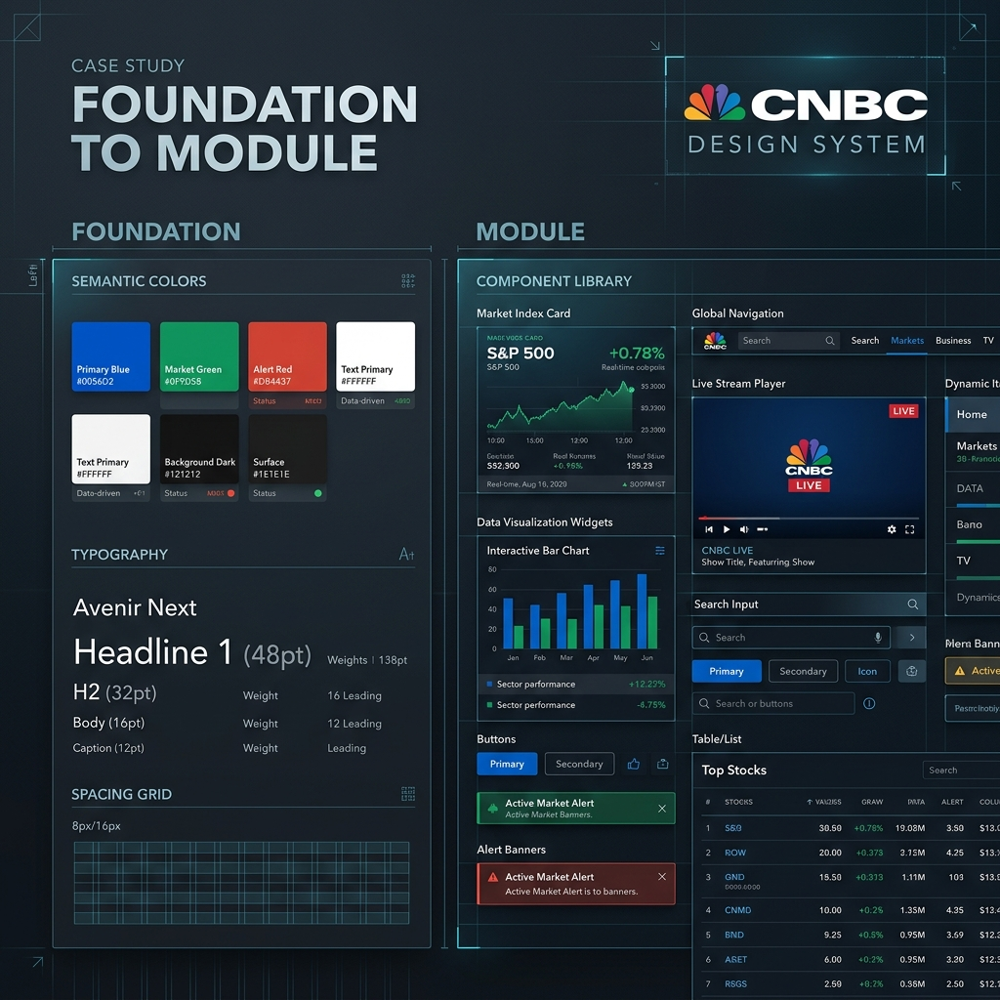

# Matt Shade — Engineering & Design Portfolio

<div align="center">
  
  <p><em>A high-fidelity, architectural portfolio ecosystem built with React, Vite, and a signature "Blueprint" design system.</em></p>

  [](https://vitejs.dev/)
  [](https://reactjs.org/)
  [](https://www.typescriptlang.org/)
  [](https://www.netlify.com/)
</div>

---

## 🏛️ Project Vision

This portfolio is more than a list of links; it's a technical sandbox and a design statement. It embodies a **"Systems Thinking"** approach, where every interaction is intentional and every component is part of a larger architectural narrative.

- **Aesthetic**: Liquid glass, blueprint grids, and "Architectural Lime" accents.
- **Performance**: Sub-second transitions and optimized asset loading.
- **Scale**: A modular structure that supports both internal case studies and complex external deployments.

---

## 🚀 Key Case Studies

### 📺 CNBC Design System
*Architecture • Systems Engineering • Product Design*
- **The Challenge**: Transforming scattered interface patterns into a production-ready ecosystem.
- **The Solution**: A "Foundation to Module" hierarchy bridging Figma and Storybook.
- **Impact**: 1,000+ components synced with 1:1 parity, drastically reducing design debt.
- **Standalone Site**: [Visit Site ↗](https://cnbcdesignsystem.shadyworldwide.com/)

### 💳 CNBC PRO Subscription
*UX Strategy • Growth • Conversion Optimization*
- **The Challenge**: Reducing friction in the premium investor journey.
- **The Solution**: A data-led redesign of the subscription funnel with a unique "PRO" visual identity.
- **Impact**: Contributed to a 400% increase in subscription velocity.

---

## 🛠️ Tech Stack & Architecture

### Core Technologies
- **React 18** (Functional Components, Hooks)
- **Vite 6** (Blazing fast HMR and optimized builds)
- **TypeScript** (Rigorous type safety across data and UI)
- **Vanilla CSS** (Custom properties for a bespoke design system)

### Project Structure
```text
src/
├── components/      # Atomic and Molecular components
├── data/            # Centralized "Source of Truth" for projects and resume
├── hooks/           # Custom logic for interactions (parallax, mouse tracking)
└── assets/          # Static markers and brand elements
```

---

## 🏗️ Deployment Flow

The portfolio uses a sophisticated **"Multi-Repo Simulation"** flow on Netlify:
1. **Isolated Builds**: Individual projects (like Canvas Intelligence) are built in their own environments.
2. **Aggregation**: A custom `copy-projects.cjs` script aggregates multiple build outputs into a single deployment directory.
3. **Canonical Routing**: `netlify.toml` manages complex redirects to ensure deep-linked projects behave like standalone apps.

```bash
# Run full development environment
npm run dev

# Execute the aggregated architectural build
npm run build
```

---

<div align="center">
  <sub>Built with intent by Matt Shade. © 2026</sub>
</div>
